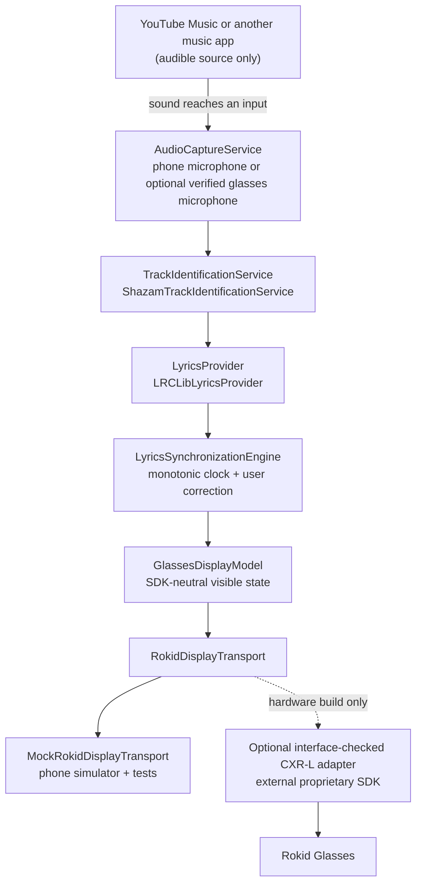
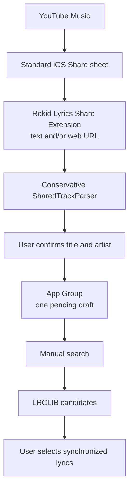

# Rokid Lyrics iOS

[](https://github.com/Klayertan/rokid-lyrics-ios/actions/workflows/ci.yml)
[](https://developer.apple.com/ios/)
[](https://www.swift.org/)
[](LICENSE)

Rokid Lyrics is an open-source SwiftUI companion app that identifies music acoustically, finds time-synchronized lyrics, and prepares a minimal previous/current/next lyric view for Rokid Glasses. YouTube Music is the primary use case, but it is treated only as an audible source—never as a private data source.

The phone app, share extension, synchronization engine, LRCLIB client, and mock glasses simulator are implemented. **The real Rokid transport has not been tested on glasses, and this repository does not claim working hardware support.** See [Project status](docs/STATUS.md) and [Rokid SDK notes](docs/ROKID_SDK_NOTES.md) for the evidence behind each status.

> [!NOTE]
> Screenshot placeholder: add verified iPhone and glasses photos only after the UI has been run on a signed device and the displayed text is synthetic or properly licensed.

## Project status

| Category | Current evidence |
| --- | --- |
| **Implemented** | Core models/protocols, LRC parser/timeline, matching, LRCLIB networking/cache, phone microphone capture, ShazamKit adapter, synchronization engine, SwiftUI app, Share extension, diagnostics, mock transport, SDK-neutral CustomView payload encoding, and conditional real-SDK coordinator/display/glasses-PCM source. |
| **Compiled** | `RokidLyricsCore` and `RokidLyricsServices` compile through Swift Package Manager. The mock app and Share extension passed strict Swift 6 whole-module arm64 iOS 17 Simulator object compilation. With `ROKID_SDK_AVAILABLE`, the full app source set passed strict arm64 iPhoneOS 17 typechecking and object emission against the actual RGCxrClient interface; this used a temporary empty `RGCoreKit` module and was not a link/app build. Generated-project verification is assigned to CI because the current local host could not load CoreSimulator. |
| **Unit tested** | 72 passed, 0 failed in the latest local `swift test --parallel` run. |
| **Simulator tested** | Not launched or interactively tested. A generic Simulator build alone will not change this category. |
| **Real Rokid SDK** | Official 1.0.4 metadata, 1.0.4.2 framework archive, headers, and sample were inspected externally. The conditional coordinator, display transport, glasses-PCM service, `AppModel` selection, and URL callback wiring passed the compiler check above, but no SDK-linked, signed, or launched app build was recorded. |
| **Hardware tested** | Not performed. No discovery, connection, rendering, Unicode, microphone, stability, or battery stage is marked passed. |

[`docs/STATUS.md`](docs/STATUS.md) is the canonical, evidence-based status record and may be newer than this summary.

## Features

- Public [ShazamKit](https://developer.apple.com/documentation/shazamkit) recognition from short-lived microphone PCM; no YouTube APIs, scraping, MediaRemote, or private iOS frameworks.
- Replaceable `AudioCaptureService`, `TrackIdentificationService`, `LyricsProvider`, `AudioAlignmentService`, and `RokidDisplayTransport` boundaries.
- Runtime lyrics search through LRCLIB's documented `GET /api/search` endpoint, with conservative metadata scoring and explicit selection for ambiguous matches.
- Complete LRC parsing and timeline lookup, including common fractional timestamp forms, multiple timestamps, metadata, global LRC offsets, duplicate timestamps, and Unicode/CJK text.
- A monotonic lyric clock with pause, resume, seek, per-track correction persistence, and manual resynchronization controls.
- SwiftUI Home, Now Playing, Connection, Search, Settings, glasses simulator, and copyable developer diagnostics screens.
- A standard iOS Share extension that accepts text and web URLs, requires title/artist confirmation when needed, and passes one draft through an App Group.
- A mock Rokid transport that remains buildable and testable without a proprietary SDK or physical glasses.
- Bounded LRCLIB caching, request cancellation, HTTP validation, timeouts, and conservative transient retries.
- English, Japanese, Chinese, and Korean text throughout the SDK-neutral model and mock UI. Physical-glasses glyph support is not yet verified.

Translation and transliteration controls are UI placeholders only; no service is implemented for either feature.

## Architecture

The main path is acoustic. The arrow from a music app to `AudioCaptureService` means sound reaching a supported microphone input; it does **not** mean access to the other app's decoded audio or playback state.



The share fallback does not scrape or resolve a shared web page:



The reusable domain and service modules are Swift packages. The iPhone app and Share extension are generated from [`project.yml`](project.yml) with XcodeGen. SDK-specific types must remain inside a transport adapter and must never escape into the synchronization engine or SwiftUI views. More detail is in [Architecture](docs/ARCHITECTURE.md).

## How it works

1. The user explicitly presses **Start Lyrics**.
2. `PhoneMicrophoneAudioCaptureService` requests microphone permission and captures a short in-memory PCM stream.
3. `ShazamTrackIdentificationService` creates a one-way signature and asks the Shazam catalog for a match using public ShazamKit APIs.
4. The matched title, artist, optional identifiers, and ShazamKit's documented playback-position estimate become a provider-neutral `TrackIdentity`. Confidence remains absent on systems where the public API does not expose it.
5. `LRCLibLyricsProvider` searches LRCLIB at runtime. `LyricsMatchScorer` ranks candidates and refuses to guess when results are weak or close.
6. `LRCParser` and `LyricTimeline` create a sorted timeline. The synchronization engine advances it from a monotonic clock and a user-adjustable offset.
7. The same `GlassesDisplayModel` drives the phone preview and `RokidDisplayTransport`. Display traffic is sent only when visible state changes or a bounded progress refresh is needed.

Microphone audio is not intentionally written to disk. Lyrics are never compiled into the app; they are fetched on demand and may be retained only in the bounded local cache described in [Privacy](docs/PRIVACY.md).

## Why YouTube Music cannot be queried directly on iOS

iOS offers no supported contract for this app to read another app's private queue, exact elapsed time, decoded audio buffers, pause/seek events, or track-change events. [`MPNowPlayingInfoCenter`](https://developer.apple.com/documentation/mediaplayer/mpnowplayinginfocenter) is documented as the object an app uses for media **that the app plays**; Rokid Lyrics does not treat it as a cross-app reader.

Accordingly, this project does not:

- call private or reverse-engineered YouTube Music APIs;
- scrape YouTube Music pages or assume a permanent share-URL structure;
- use MediaRemote, private frameworks, or undocumented notifications;
- claim sample-accurate synchronization with YouTube Music.

Recognition and timing are estimates. If the user pauses, seeks, changes playback speed, encounters an advertisement, or changes songs, Rokid Lyrics is not notified. Use the sync controls, re-run recognition, or use the Share/manual-search workflow. See [YouTube Music and iOS limitations](docs/YOUTUBE_MUSIC_LIMITATIONS.md).

## Requirements

### Public/mock development

- macOS with Xcode 16.4 or newer and the iOS platform installed.
- Swift 6.
- [XcodeGen 2.46.0](https://github.com/yonaskolb/XcodeGen/releases/tag/2.46.0) or newer.
- iOS 17 or newer for the app target.
- No Rokid framework, credentials, or glasses for package tests and mock-mode builds.

### Signed iPhone development

- An Apple Developer team, unique app and extension bundle identifiers, and matching provisioning profiles.
- A registered App Group shared by the containing app and extension.
- The ShazamKit App Service enabled for the app's App ID.
- A physical iPhone for meaningful microphone, audio-route, Shazam catalog, Share extension, and background-transition testing.

### Hardware development

- Compatible display-capable Rokid Glasses, current supported firmware, and the appropriate Rokid companion app/account authorization required by the official SDK.
- The official CXR-L iOS SDK installed externally under its own terms.
- A physical arm64 iPhone. The inspected CXR-L framework has no iOS Simulator slice.
- Use an Xcode 26.5-or-newer toolchain for the first SDK-linked attempt: the framework metadata identifies Xcode/iPhoneOS SDK 26.5, and this repository's interface check used Xcode 26.6. Compatibility with older compilers is not claimed. The Xcode 16.4 CI job is mock-only.

## Build and test

Clone the repository and run the deterministic package tests:

```sh
git clone https://github.com/Klayertan/rokid-lyrics-ios.git
cd rokid-lyrics-ios
swift test --parallel
```

The latest local run completed **72 tests with 72 passing and 0 failing**. Tests use fictional lyric text, injected networking, and the mock transport; they do not contact LRCLIB, invoke live Shazam matching, or require glasses.

Generate the Xcode project and build the unsigned public/mock configuration:

```sh
brew install xcodegen
xcodegen generate

xcodebuild \
  -project RokidLyrics.xcodeproj \
  -scheme RokidLyrics \
  -configuration Debug \
  -destination 'generic/platform=iOS Simulator' \
  CODE_SIGNING_ALLOWED=NO \
  ROKID_SDK_AVAILABLE=NO \
  build
```

[`RokidLyrics.xcodeproj`](RokidLyrics.xcodeproj) is generated output. Run `xcodegen generate` after changing [`project.yml`](project.yml), target files, entitlements, or configuration; do not hand-edit the generated project.

CI runs `swift test --parallel` and the same generic iOS Simulator build on a public GitHub-hosted macOS runner without downloading or linking the proprietary Rokid SDK.

## Running

### Mock Mode

1. Run `xcodegen generate` and open `RokidLyrics.xcodeproj`.
2. Select the **RokidLyrics** scheme and an iPhone Simulator or signed iPhone.
3. Build and run.
4. In **Settings**, leave **Developer / Mock Mode** enabled.
5. Open **Rokid**, press **Connect**, and use the glasses simulator to inspect display state without hardware.
6. Use **Find Lyrics** with a title and artist to exercise LRCLIB without live recognition. Selecting a result starts at `0:00`; use the sync controls to align it.

The iOS Simulator is useful for UI and mock transport work. It is not evidence that microphone coexistence, catalog recognition, App Group provisioning, or glasses communication works on a device.

### Signed iPhone setup

Before a device run:

1. Replace the placeholder bundle identifiers in [`project.yml`](project.yml) with identifiers owned by your Apple Developer team.
2. Register the same App Group for the app and extension. If its identifier changes, update both entitlement files and `SharedTrackInbox.defaultAppGroupIdentifier`.
3. Set your development team locally in Xcode or on the build command line. Do not commit a personal team ID or provisioning profile.
4. Regenerate the project with `xcodegen generate`.
5. Grant microphone access only when you intend to start recognition.

A generic signed build command has this shape:

```sh
xcodebuild \
  -project RokidLyrics.xcodeproj \
  -scheme RokidLyrics \
  -configuration Debug \
  -destination 'generic/platform=iOS' \
  DEVELOPMENT_TEAM="$APPLE_TEAM_ID" \
  ROKID_SDK_AVAILABLE=NO \
  -allowProvisioningUpdates \
  build
```

Keep `APPLE_TEAM_ID` in your shell or private CI secret; never add it to the repository.

## Apple and ShazamKit configuration

Apple requires the ShazamKit service for catalog recognition. In **Certificates, Identifiers & Profiles → Identifiers → your App ID → App Services**, enable **ShazamKit**, then refresh signing assets as needed. Follow Apple's official [Enable ShazamKit for an App ID](https://developer.apple.com/help/account/services/shazamkit/) instructions.

ShazamKit is an App ID service. **Do not invent or add a `com.apple.developer.shazamkit` entry to the local entitlements file.** This repository intentionally declares only the capabilities it actually uses, such as the App Group. The app already includes an `NSMicrophoneUsageDescription`; preserve an accurate description in distributed builds.

Catalog matching must be validated on a properly signed physical device with network access. A successful package or Simulator build does not prove that the App ID service or provisioning is correct.

## LRCLIB behavior

The default provider calls LRCLIB's documented [`GET /api/search`](https://lrclib.net/docs) endpoint with title, artist, and optional album metadata. No API key is required. Requests identify this open-source client with a `User-Agent`, use a 15-second request timeout, validate HTTP status and JSON, propagate cancellation, and retry only a bounded set of transient failures. A valid `Retry-After` header is respected rather than bypassed.

Search returns candidates instead of silently choosing a record. Matching considers conservative title, artist, featured-artist, version, optional album, and optional duration signals. Unicode normalization supports canonical equivalence and full-width Latin while preserving meaningful Japanese, Chinese, and Korean text. Weak or ambiguous matches require user selection.

Only a non-instrumental candidate with parseable synchronized lyrics can start the timeline. Plain lyrics may be shown as candidate metadata but are not fabricated into timestamps. Runtime results are cached in the app's Caches directory for up to 30 days, capped at 100 entries; cache failure never converts a failed network request into a false success. The repository contains no fetched lyrics or lyric database. See [Lyrics provider](docs/LYRICS_PROVIDER.md).

## Rokid SDK setup

The public/mock build does not download a Rokid binary. That separation is intentional: the official package is proprietary and its terms are not the MIT license used by this repository.

The verified distribution metadata currently has two related version strings:

- CocoaPods pod version **`RGCxrClient` 1.0.4** in the official [podspec](https://cdn.cocoapods.org/Specs/b/d/c/RGCxrClient/1.0.4/RGCxrClient.podspec.json).
- The framework archive referenced by that podspec is named **`RGCxrClient_1.0.4.2.framework.zip`** at Rokid's [official artifact URL](https://rokid-ota.oss-cn-hangzhou.aliyuncs.com/toB/Rokid_Glass/SDK/CXR-L%28iOS%29/release/RGCxrClient_1.0.4.2.framework.zip).

Rokid also publishes an [official CXR-L 1.0.4 iOS sample](https://rokid-ota.oss-cn-hangzhou.aliyuncs.com/toB/Document/CXR-L/v1.0.4/iOS/ios_cxr_l_sample.zip). Review the [Rokid SDK portal](https://open.rokid.com/sdk?lang=en) and [Rokid Developer Community Service Agreement](https://developer.rokid.com/docs/4-TermsAndAgreements/community-service-agreement.html) before downloading or using either archive.

Important package facts from the inspected 1.0.4/1.0.4.2 release:

- the podspec declares `RGCxrClient.framework`, Swift 5 compatibility, and a dependency on `RGCoreKit` 0.0.2;
- the binary contains an arm64 iPhone slice, not an iOS Simulator slice;
- although the podspec advertises iOS 13, the inspected framework load command records iOS 16 as its minimum; this project targets iOS 17;
- the official sample and framework must be obtained outside this repository and must not be committed, mirrored, or relicensed under MIT;
- SDK authorization, compatible companion-app behavior, firmware compatibility, display limits, and background behavior still require official support confirmation and physical-device testing.

Keep `ROKID_SDK_AVAILABLE=NO` for ordinary development and CI. The SDK-neutral CustomView payload encoder and `RokidDisplayTransport` boundary can be exercised without the framework. Enable a hardware configuration only after installing the exact official dependencies and keeping all local SDK paths, authorization data, callback schemes, and credentials outside Git.

For an experimental local SDK-linked build, CocoaPods is the verified package route represented by [`Config/Podfile.hardware.example`](Config/Podfile.hardware.example). Run these steps only after reviewing Rokid's terms:

```sh
brew install cocoapods
xcodegen generate
cp Config/Podfile.hardware.example Podfile
pod install
cp Config/RokidSDK.xcconfig.example Config/Local.xcconfig
open RokidLyrics.xcworkspace
```

Open the generated workspace, not the project, for that configuration. The app target's Debug and Release configuration files optionally include CocoaPods' generated settings, while the Share Extension remains SDK-free. XcodeGen owns the project file, so run `pod install` again after every `xcodegen generate`. Keep `Podfile`, `Pods/`, `Config/Local.xcconfig`, SDK archives, and CocoaPods-generated integration changes out of commits unless the repository later adopts and reviews a distributable hardware-integration policy. The conditional adapter is wired into the app when the feature condition is active, but it still needs a successful SDK-linked build before Mock Mode can be replaced with compiled evidence.

The authoritative installation/blocker record is [Rokid SDK notes](docs/ROKID_SDK_NOTES.md). The manual evidence stages are in [Hardware test plan](docs/HARDWARE_TEST_PLAN.md).

## Hardware Mode

Hardware Mode is an engineering/test configuration, not a supported end-user claim. Before attempting it:

1. Complete the signed-iPhone setup and confirm the public/mock build first.
2. Read and accept Rokid's current terms yourself.
3. Obtain the exact official SDK and sample from the links above; keep them in an ignored local/vendor location.
4. Follow the CocoaPods/workspace sequence above and configure any required authorization locally. Never commit SDK archives, generated Pods, credentials, certificates, authorization files, or provisioning profiles.
5. Enable the optional adapter only for a physical `iphoneos` build. Continue using `ROKID_SDK_AVAILABLE=NO` for Simulator and public CI.
6. Execute [Hardware test plan](docs/HARDWARE_TEST_PLAN.md) from discovery through the 30-minute stability stage, recording device, firmware, app, SDK, and result evidence.

After the workspace and private signing configuration exist, a device build has this command shape:

```sh
xcodebuild \
  -workspace RokidLyrics.xcworkspace \
  -scheme RokidLyrics \
  -configuration Debug \
  -destination 'generic/platform=iOS' \
  DEVELOPMENT_TEAM="$APPLE_TEAM_ID" \
  -allowProvisioningUpdates \
  build
```

Treat a successful build only as **compiled** evidence. It does not establish SDK authorization, a connection, display output, microphone delivery, or hardware stability.

No hardware stage has been reported as passed. A conditional `RokidMicrophoneAudioCaptureService` maps the inspected official audio callback into the app's PCM model and is selected with the real transport, but no linked build or device stream has verified that audio is actually available.

## Using with YouTube Music

### Acoustic recognition

1. Start music in YouTube Music and make it audible to the selected iPhone microphone.
2. Keep Rokid Lyrics in the foreground and press **Start Lyrics**.
3. Watch the visible microphone/listening indicator.
4. Confirm the identified track or choose a candidate when matching is ambiguous.
5. Align the lyrics with **Sync** or the offset controls.

The default phone capture service requests `.playAndRecord`, `.mixWithOthers`, and `.defaultToSpeaker`. Those options ask iOS to permit input while mixing other audio, but they do not guarantee that every YouTube Music version, output route, Bluetooth device, or phone model will continue unchanged. Playback may pause, duck, reroute, feed back, or become inaudible to the microphone. This interaction has not yet been validated on a physical device; a second audible speaker or the Share/manual workflow may be more reliable. The conditional glasses-microphone service does not configure `AVAudioSession`, but its simultaneous behavior with YouTube Music is also untested.

### Share or manual fallback

1. In YouTube Music, use the standard Share sheet and choose **Rokid Lyrics** if the extension is available.
2. Verify or enter both title and artist. A URL alone is not treated as trustworthy metadata and is never opened or scraped.
3. Return to Rokid Lyrics, search LRCLIB, and select a synchronized candidate.
4. Manually align playback because a share item provides no reliable elapsed position.

The exact attachment representations supplied by YouTube Music can change with app version, locale, or account. The current payload has not been characterized on a physical iPhone, so confirmation is always preferred to guessing.

### Foreground and background limits

Plan to keep Rokid Lyrics in the foreground during recognition and active lyric display. The project does not declare an audio background mode and does not claim continuous background microphone capture or uninterrupted lyric updates after suspension. Even when a hardware configuration uses a Bluetooth-central declaration, that does not grant arbitrary background execution. Screen locking, switching apps, route changes, and interruptions remain physical-device test items.

## Synchronization controls

| Control | Effect |
| --- | --- |
| **-5** / **-1** | Delays lyric selection by 5 or 1 second. |
| **Sync** | Aligns the active lyric line to the current lyric-clock position. |
| **+1** / **+5** | Advances lyric selection by 1 or 5 seconds. |
| **Previous lyric** | Makes the previous line active by calculating a correction from the current clock position. |
| **Next lyric** | Makes the next line active the same way. |
| **Pause / Resume** | Freezes or resumes the independent monotonic lyric clock; it does not control YouTube Music. |

Corrections are persisted locally per track when a stable track identifier is available. An embedded LRC `[offset:...]` and the user's manual correction are kept as separate concepts. Network/lookup latency and future source-player seeks can still produce drift.

## Troubleshooting

### The project file is stale or files are missing in Xcode

Run `xcodegen generate` from the repository root. Check that XcodeGen is at least 2.46.0 and open the newly generated `RokidLyrics.xcodeproj`.

### Xcode cannot find an iOS Simulator or required platform

Select the intended Xcode installation, finish its first-launch setup, and install an iOS Simulator runtime in Xcode Settings. For example:

```sh
sudo xcode-select --switch /Applications/Xcode.app/Contents/Developer
sudo xcodebuild -runFirstLaunch
```

### ShazamKit returns no match or an authorization/service error

- Verify the ShazamKit App Service is enabled for the exact signed app App ID.
- Do not add a made-up ShazamKit entitlement.
- Confirm microphone permission, network access, an audible input route, and at least several seconds of clear music.
- Test on a signed physical iPhone; package tests and a Simulator are not catalog-recognition evidence.

### YouTube Music pauses, ducks, reroutes, or is not recognized

This is an audio-session/route coexistence limitation, not access to YouTube Music. Try the phone speaker at a moderate volume, another audible speaker, or the Share/manual-search workflow. Record the exact phone, iOS, YouTube Music version, and route in a hardware test report.

### LRCLIB returns no safe synchronized match

Open **Find Lyrics**, enter the canonical title and primary artist, and review the candidates. A record can be plain-only, instrumental, malformed, absent, or ambiguous; the app deliberately does not invent synchronization or select a risky result.

### The Share extension is missing or the draft does not arrive

Confirm the extension is enabled in the Share sheet, both targets are signed by the same team, and both entitlements use the same registered App Group. If the App Group identifier was changed, also update `SharedTrackInbox.defaultAppGroupIdentifier` and regenerate the project.

### A Rokid framework fails on Simulator or CI

Use `ROKID_SDK_AVAILABLE=NO`. The inspected framework is an arm64 device binary without a Simulator slice and is intentionally absent from public CI. Hardware work belongs in a separately configured `iphoneos` build.

### Lyrics are early, late, or drift after a seek

Use **Sync**, the ±1/±5 controls, or previous/next lyric navigation. The app cannot observe another player's seek, pause, advertisement, or playback-rate change.

### CJK text appears in the phone simulator but not on glasses

The domain model and JSON path preserve Unicode. Actual Japanese, Chinese, and Korean glyph availability depends on the verified glasses rendering stack and firmware; do not assume a font can be installed. Record the exact failing strings and firmware without including copyrighted lyrics.

## Privacy

Listening starts only after the user presses **Start Lyrics**. The phone path requests Apple's microphone permission; the conditional glasses path requests the official SDK's microphone authorization scope. Raw PCM stays in a bounded in-memory stream and is not intentionally saved. The derived Shazam signature is passed to ShazamKit; LRCLIB receives title/artist/optional album query metadata over HTTPS; artwork may be loaded from the URL supplied by ShazamKit.

Lyrics candidates can be stored in the bounded Caches directory, settings and per-track offsets in `UserDefaults`, and one confirmed share draft in App Group `UserDefaults`. Copyable diagnostics can include song metadata and short visible lyric fragments, so users should review them before sharing. No analytics, advertising SDK, tracker, private YouTube credential, or raw-audio recorder is included. See the full [Privacy](docs/PRIVACY.md) inventory.

## Copyright

This repository does not contain fetched lyrics, real-song lyric fixtures, or a redistributable lyric database. Tests and documentation use short fictional lines. Lyrics are requested from LRCLIB at runtime and remain subject to their own copyright, provider terms, territorial rules, and the user's lawful use; they are **not** covered by this project's MIT license. Contributors must not add copyrighted lyric dumps, screenshots with unlicensed lyrics, or recordings.

Rokid SDK binaries, samples, trademarks, and documentation remain subject to Rokid's terms and are not relicensed by this project. YouTube, YouTube Music, Apple, ShazamKit, LRCLIB, and Rokid are names of their respective owners; this project does not imply endorsement or partnership.

## Development roadmap

- Complete and record a full workspace link/build against the real RGCxrClient 1.0.4 / framework 1.0.4.2 and RGCoreKit dependency without making the public build depend on them.
- Validate discovery, authorization, CustomView rendering, update limits, reconnect behavior, and Unicode on physical Rokid hardware.
- Characterize iPhone microphone/YouTube Music coexistence across speaker, wired, Bluetooth, interruption, lock, and foreground/background routes.
- Add signed-device Shazam integration tests, Share extension/App Group UI tests, SwiftUI accessibility tests, and visual regression coverage.
- Measure acoustic, recognition, rendering, and long-session drift; evaluate a documented `AudioAlignmentService` only when a supported audio input makes it useful.
- Add clear-cache and clear-correction controls, settings migration, and richer offline state.
- Characterize current YouTube Music share payloads by locale/version while retaining mandatory confirmation for insufficient metadata.
- Consider translation and transliteration only through explicit, replaceable, properly licensed providers.
- Complete the 30+ minute hardware battery, heat, disconnect, update-traffic, and drift plan before making any stability claim.

## Documentation

- [Architecture](docs/ARCHITECTURE.md)
- [Project status](docs/STATUS.md)
- [Rokid SDK notes](docs/ROKID_SDK_NOTES.md)
- [YouTube Music and iOS limitations](docs/YOUTUBE_MUSIC_LIMITATIONS.md)
- [Lyrics provider](docs/LYRICS_PROVIDER.md)
- [Privacy](docs/PRIVACY.md)
- [Testing](docs/TESTING.md)
- [Hardware test plan](docs/HARDWARE_TEST_PLAN.md)

## License

Original code in this repository is available under the [MIT License](LICENSE). That license does not cover third-party SDKs, proprietary binaries, provider content, artwork, lyrics, trademarks, or other materials supplied under separate terms.
