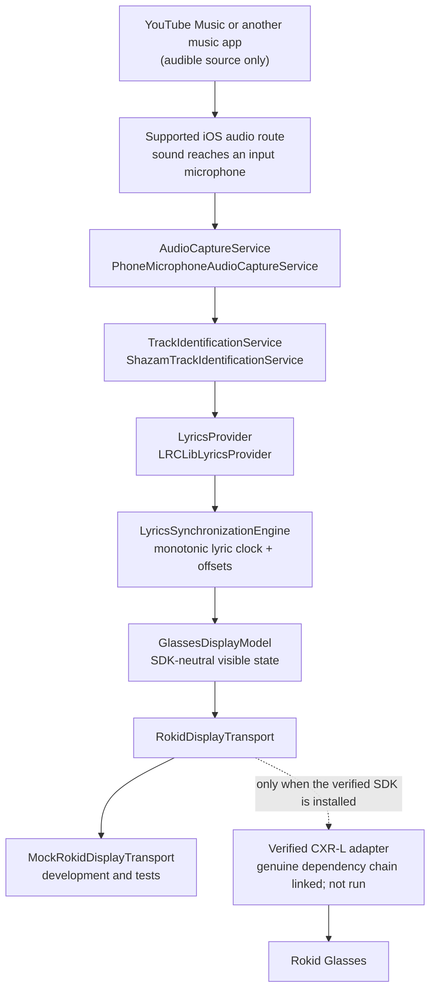
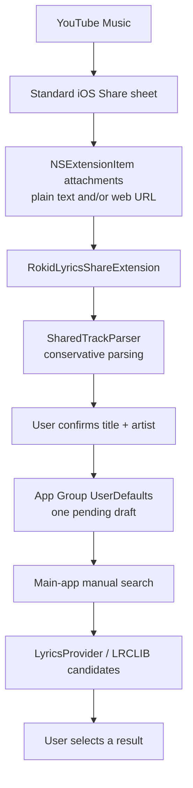
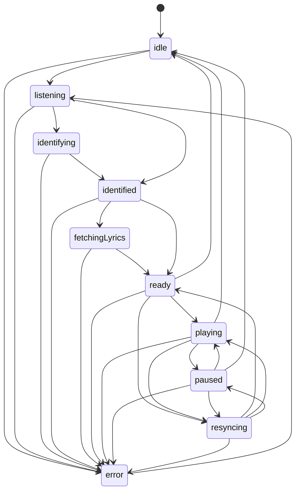

# Architecture

Rokid Lyrics iOS is an iPhone companion app that turns audible music into a small, time-synchronized lyric state. YouTube Music is an audio source only: the app does not inspect its process, queue, player, or private APIs.

The repository targets iOS 17 and Swift 6. The reusable domain and service modules are Swift packages, while the iPhone app and Share Extension are generated from `project.yml` with XcodeGen. Dedicated **Rokid Lyrics Mock** and **Rokid Lyrics Hardware** schemes keep the proprietary device-only dependency out of public builds; the legacy **RokidLyrics** scheme remains mock-safe.

## System context

The primary path uses sound that reaches a supported iOS microphone input. The arrow from the music app to the microphone is acoustic/routed audio, not access to the other app's digital audio stream.

Apple documents ShazamKit as matching an acoustic signature generated from captured audio, including microphone audio. A signature is a one-way representation and cannot be converted back into the recording: [ShazamKit](https://developer.apple.com/documentation/shazamkit) and [SHSignatureGenerator](https://developer.apple.com/documentation/shazamkit/shsignaturegenerator).

The fallback share path is deliberately independent of recognition:

Apple describes Share extensions as receiving initial text and attachments through their `NSExtensionContext`; the host decides which representations it supplies. See [App Extension Programming Guide: Share](https://developer.apple.com/library/archive/documentation/General/Conceptual/ExtensibilityPG/Share.html). The extension and containing app exchange the pending draft through an App Group suite, using Apple's documented [`UserDefaults.init(suiteName:)`](https://developer.apple.com/documentation/foundation/userdefaults/init%28suitename%3A%29).

## Modules and dependency direction

| Module | Responsibility | May depend on |
| --- | --- | --- |
| `RokidLyricsCore` | Domain models, protocols, LRC parsing, matching, timeline, clock, synchronization state machine, in-memory correction store, mock display transport | Foundation only |
| `RokidLyricsServices` | AVFoundation microphone capture, ShazamKit identification, LRCLIB networking/cache, `UserDefaults` correction persistence, share parsing/inbox/App Group resolution, and diagnostic sanitization | `RokidLyricsCore`, Apple frameworks |
| `RokidLyrics` | SwiftUI presentation, the injectable `AppModel` composition/orchestration layer, device-validation diagnostics, isolated hardware-test controls, and conditional CXR-L app adapters | Core, Services, and the optional SDK only in SDK-enabled device builds |
| `RokidLyricsShareExtension` | Standard share-item intake and explicit metadata confirmation | Services |
| `Tests` | Deterministic domain and service tests with synthetic lyrics and injected doubles | Core and Services |

The dependency rule is inward: views can depend on domain state, but the domain has no dependency on SwiftUI, AVFoundation, networking, LRCLIB, ShazamKit, or a Rokid SDK. SDK-specific types must stay inside a concrete transport adapter.

## Replaceable boundaries

| Protocol | Current implementation | Contract |
| --- | --- | --- |
| `AudioCaptureService` | `PhoneMicrophoneAudioCaptureService`; conditional `RokidMicrophoneAudioCaptureService` source behind the verified SDK flag | Produces ephemeral, normalized PCM frames and stops capture on success, failure, termination, or cancellation. The glasses path is never enabled in the public/mock build and remains untested on hardware. |
| `TrackIdentificationService` | `ShazamTrackIdentificationService` | Turns a captured-audio stream into `TrackIdentity`. Confidence remains optional when the backing API/OS does not expose it. |
| `LyricsProvider` | `LRCLibLyricsProvider` | Returns provider-neutral candidates; it does not silently choose one. |
| `AudioAlignmentService` | No implementation | Future extension point for a documented signal-based playback-position estimate. No speculative ML implementation is included. |
| `SyncCorrectionStore` | In-memory and `UserDefaults` implementations | Reads and writes per-track manual offsets. |
| `RokidDisplayTransport` | Mock transport; conditional `CXRLRokidDisplayTransport` when the verified SDK is available | Connects, disconnects, sends a complete `GlassesDisplayModel`, and clears output without leaking SDK types. Compilation is not hardware evidence. |

`AppModel` is the composition root and accepts optional injected services for tests/alternate builds. The Mock configurations force Mock Mode and use the phone microphone. In an SDK-enabled device build, turning Mock Mode off constructs one shared `RokidCXRCoordinator`, a `CXRLRokidDisplayTransport`, and a `RokidMicrophoneAudioCaptureService`; the SwiftUI app forwards the registered callback URL to that coordinator. Switching modes is allowed only while synchronization is idle and disconnects/stops the previous adapters.

That wiring has now compiled and linked into an unsigned arm64 iOS 17 target-mode app against genuine CocoaPods-resolved `RGCxrClient` 1.0.4, `RGCoreKit` 0.0.2, and `CocoaLumberjack` 3.9.1, with all three frameworks embedded. The validation excluded `Assets.xcassets` only to bypass this host's missing `actool` runtime. The normal Hardware workspace build still cannot start because the iOS 26.5 platform is unavailable. Nothing has been signed, installed, launched, authorized, or hardware-tested.

## Build and signing boundary

`Config/Base.xcconfig` provides clone-buildable defaults and optionally includes ignored `Config/Local.xcconfig`. Developers copy `Config/Local.xcconfig.example` and keep the following values out of source control:

- development team;
- main-app and Share Extension bundle identifiers;
- shared App Group identifier;
- build-mode label and default Mock Mode value.

The main and extension bundle IDs and development team expand into generated target settings. The App Group expands into both entitlements and both Info.plists. `SharedTrackAppGroupResolver` reads the target's expanded Info value, so `SharedTrackInbox` and the Share Extension use the same locally configured suite without a hard-coded runtime composition.

`Mock-Debug`/`Mock-Release` remove the real-SDK compilation condition even if proprietary pods exist locally. `Rokid-Hardware-Debug`/`Rokid-Hardware-Release` define it and, for the main app only, include CocoaPods' matching target settings. The Share Extension never links RGCxrClient. Public CI selects the named Mock scheme and contains no Rokid framework or credential.

Both generated targets force `TARGETED_DEVICE_FAMILY=1`. A `Mock-Debug` target-mode validation linked an unsigned arm64 iOS 17 app and embedded the Share Extension with the asset catalog excluded only to bypass this host's broken `actool`; the result was not an asset-complete, signed, installed, or launched app. The historical public CI run remains the normal generated generic-Simulator build evidence.

## Device-validation boundary

Physical validation is explicit and opt-in:

- `PhysicalDeviceDiagnosticsView` observes only public audio-session properties/notifications and exposes a human-recorded YouTube Music coexistence result, Shazam timing/metadata, timeline state, and an uncached LRCLIB metadata/availability test. It never inspects PCM or displays fetched lyric bodies in that live-provider test.
- `RokidHardwareTestView` separates connection, synthetic static/update/clear/Unicode display actions, and glasses-PCM metrics from the complete pipeline. End-to-end start is gated on a tester confirmation and an active connection.
- `SafeDeviceDiagnosticReport` exports typed, bounded state. `DiagnosticSanitizer` redacts common credential shapes and strips sensitive URL components. The report uses route port types rather than route/device names, omits raw audio and lyric bodies, and records only an active-line character count for the last display payload.

These tools help collect evidence; their existence does not count as a live-service, device, or hardware result. Procedures and blank records live in `docs/PHYSICAL_IPHONE_SETUP.md`, `docs/YOUTUBE_MUSIC_DEVICE_TEST.md`, and `docs/DEVICE_TEST_SESSION.md`.

## Recognition and lyrics flow

1. `AppModel` moves the synchronization engine from `idle` to `listening` and `identifying`.
2. `PhoneMicrophoneAudioCaptureService` requests microphone permission, configures an iOS `.playAndRecord` session with `.mixWithOthers` and `.defaultToSpeaker`, installs an `AVAudioEngine` input tap, and yields in-memory PCM frames. It writes no audio files.
3. `ShazamTrackIdentificationService` accumulates about eight seconds of audio by default, generates a Shazam signature, and requests a catalog result with public ShazamKit APIs.
4. A match becomes `TrackIdentity`. The implementation uses ShazamKit's documented [`predictedCurrentMatchOffset`](https://developer.apple.com/documentation/shazamkit/shmatchedmediaitem/predictedcurrentmatchoffset) as the best initial playback-position estimate. The Shazam confidence value is populated only on OS versions where that public property is available; otherwise it is `nil` rather than invented.
5. `LRCLibLyricsProvider` calls the documented `GET /api/search` endpoint with title, artist, and optional album fields. See [LRCLIB API documentation](https://lrclib.net/docs).
6. The automatic path first excludes instrumental and missing/empty synchronized-lyrics records, then `LyricsMatchScorer` ranks the viable candidates. It selects only one candidate above the safety threshold with no similarly scored competitor. Ambiguous and low-scoring results route to explicit user selection; the search UI may still show otherwise unusable provider records for transparency.
7. `LRCParser` creates an immutable, sorted `LyricDocument`. `LyricTimeline` performs binary-search lookup of previous, active, and next lines.
8. `LyricsSynchronizationEngine` starts its monotonic clock and publishes `GlassesDisplayModel` values to both the phone UI and display transport.

No raw lyrics are compiled into the app. Provider lyrics are requested at runtime; tests use short fictional strings only.

In the default/mock composition, step 2 uses the phone microphone. In an explicitly SDK-enabled, non-mock device build, the verified CXR-L media interface supplies PCM16 frames through `RokidMicrophoneAudioCaptureService`. That adapter shares the authenticated CustomView coordinator with the display transport, converts bytes to normalized in-memory frames, and assigns local monotonic receipt timestamps because SDK timestamp units are undocumented. No device result is claimed.

## Synchronization model

The state machine enforces valid transitions. The lyric clock uses `ProcessInfo.processInfo.systemUptime`, so wall-clock changes do not shift lyrics.

Timeline semantics:

- A positive `syncOffsetSeconds` advances lyric selection; a negative value delays it.
- An embedded LRC `[offset:milliseconds]` moves lyric timestamps and is accounted for separately.
- Seek changes the monotonic clock anchor without changing pause state.
- Pause freezes the position; resume establishes a new monotonic anchor.
- Previous/next-line controls compute and persist the correction needed to make that line active now.
- `Sync Now` aligns the active line's timestamp with the current lyric-clock position.
- Per-track corrections are keyed by `TrackIdentity.id` and stored in `UserDefaults` in the app.

This is an estimate, not access to the source player's clock. When ShazamKit supplies a predicted position, the implementation starts the monotonic clock as soon as the track is identified so it continues advancing during lyrics lookup and parsing. That compensates for local lookup latency, but it cannot observe subsequent source-player pauses, seeks, ads, track changes, or route delays. Manual sync controls are therefore part of the MVP, not an optional embellishment.

## Display update policy

`GlassesDisplayModel` contains only track text, the previous/current/next lyric lines, optional progress, status, and SDK-neutral display preferences. UI and synchronization code never reference Rokid SDK classes.

The app evaluates the timeline approximately every 200 ms while playing, but it does not send every evaluation. It sends when visible text/status changes, when explicitly forced by a user action, or for a slow progress refresh. The mock transport also coalesces duplicate models. A real transport must adapt this policy to verified SDK constraints without changing the domain API.

If transport connectivity is lost, the synchronization engine continues independently. The app attempts mock/transport reconnection at a bounded interval and pushes current state after connection. Real-device reconnection behavior remains a hardware test item.

## Persistence and runtime data

| Data | Storage | Current retention |
| --- | --- | --- |
| Settings | Standard `UserDefaults` | Until reset/uninstall |
| Per-track sync corrections | Standard `UserDefaults` | Until removed/reset/uninstall |
| LRCLIB candidates and lyrics | App Caches directory | Up to 100 entries; 30-day age limit in the app composition |
| Pending share draft | App Group `UserDefaults` resolved from the target's expanded build setting | One draft; removed when the main app consumes it |
| Raw microphone PCM | Memory stream only | Capture session only; never intentionally written to disk |
| Current session/display state | Memory | Process/session lifetime |

Cache failures do not fail lyric lookup. Cache data is provider runtime content, not repository content.

## Platform constraints

- The project treats `MPNowPlayingInfoCenter` as a publishing API for media an app itself plays, not as a supported cross-app query mechanism. Apple's documentation describes it as “an object for setting the Now Playing information for media that your app plays”: [MPNowPlayingInfoCenter](https://developer.apple.com/documentation/mediaplayer/mpnowplayinginfocenter).
- `.mixWithOthers` asks iOS to mix with other active audio sessions, but actual YouTube Music continuation, routing, ducking, and recognition quality require physical-device testing. See Apple's [`mixWithOthers`](https://developer.apple.com/documentation/avfaudio/avaudiosession/categoryoptions-swift.struct/mixwithothers) documentation.
- The app currently declares only the `bluetooth-central` `UIBackgroundModes` value for the optional device-connection path; it does not declare the `audio` value. That does not authorize or prove continuous background microphone capture, lyric advancement, networking, or SDK display updates. Apple documents the distinct background-mode values at [`UIBackgroundModes`](https://developer.apple.com/documentation/bundleresources/information-property-list/uibackgroundmodes).
- The share extension can consume only the standard representations supplied by the host. A URL alone is never reverse-engineered or scraped for metadata.
- The optional real Rokid path and its proprietary-package setup are isolated from the always-buildable mock path. Verified package facts and remaining SDK blockers belong in [`ROKID_SDK_NOTES.md`](ROKID_SDK_NOTES.md).
- Physical-device observations must follow [`YOUTUBE_MUSIC_DEVICE_TEST.md`](YOUTUBE_MUSIC_DEVICE_TEST.md) and [`HARDWARE_TEST_PLAN.md`](HARDWARE_TEST_PLAN.md); compiler/link output and diagnostic UI labels never become device evidence on their own.

## Deliberately out of scope for the MVP

- Reading YouTube Music playback metadata, queue, elapsed time, or audio buffers through undocumented mechanisms.
- Scraping shared URLs or depending on a fixed YouTube Music URL shape.
- A speculative audio-alignment ML model.
- Translation or transliteration; settings are labeled as planned placeholders.
- Redistributing a proprietary Rokid SDK binary.
- Claiming working hardware support merely because the real adapter links; physical devices must pass the hardware plan first.
